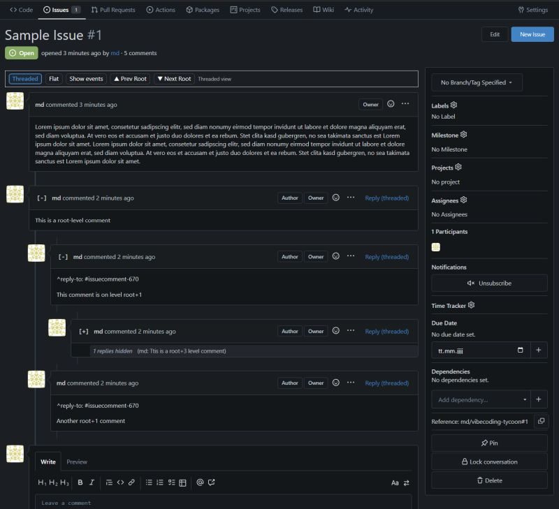

# Gitea Threaded Issues Customization

Gitea does not support threaded views in issues. A [FR](https://github.com/go-gitea/gitea/issues/20215) for this is open since Jul 2022 and it does not look like gitea will support this natively anytime soon.

This customization adds threaded comment functionality to Gitea's issues view, allowing users to organize comments into reply threads, by using purely client-side JavaScript and CSS, utilizing the existing [gitea customization flow](https://docs.gitea.com/administration/customizing-gitea) (`CustomPath`).

[](preview.jpg)

It came to life utilizing AI and it's not pretty but it gets the job done and reduces a pain point we had internally.

## Features

- **Threaded View**: (initial default) Organizes comments into reply threads with visual indentation (up to 4 levels)
- **Flat View**: Traditional chronological view of all comments
- **Reply-to Support**: Reply to specific comments using `^reply-to: #issuecomment-XXX` markers
- **Collapse/Expand**: Collapse threads to hide replies and show previews (up to 80 characters)
- **Event Filtering**: (initial default: hidden) Toggle timeline events (label changes, status updates, etc.)
- **Navigation**: Navigate between root comments with Previous/Next buttons
- **Persistent Settings**: View preferences and collapsed state saved in browser localStorage
- **Floating Control-Bar:** The control-bar is always visible and can be used to switch between threaded and flat views, toggle events, and navigate between root comments.

## Installation

This customization is installed in Gitea's `CustomPath`:

```
/var/lib/gitea/custom/
├── public/
│   └── assets/
│       ├── css/
│       │   └── threaded-issues.css
│       └── js/
│           └── threaded-issues.js
└── templates/
    └── custom/
        ├── header.tmpl  (loads CSS)
        └── footer.tmpl  (loads JS)
```
> The `CustomPath` is by default the `custom` folder from the working directory (`WorkPath`), but may be different if your installation has set this differently.

After that, restart gitea service:
```
sudo systemctl restart gitea
```

## Usage

### Viewing Threads

1. Navigate to any issue page
2. Use the control bar at the top of the timeline to switch between:
   - **Threaded**: Comments organized by reply relationships
   - **Flat**: Traditional chronological order
   - **Toggle events**: Show/hide timeline events

### Replying to Comments

1. Click **"Reply (threaded)"** on any comment
2. The editor will be pre-filled with `^reply-to: #issuecomment-XXX`
3. Add your reply below the marker
4. Submit the comment

The reply marker (`^reply-to: #issuecomment-XXX`) must be on the first non-empty line of the comment for threading to work.

### Collapsing Threads

- Click the **[-]** button next to any comment with replies to collapse it
- Click **[+]** to expand and show all replies
- Collapsed threads show a summary with reply count and preview text

### Navigation

In threaded view, use **▲ Prev Root** and **▼ Next Root** buttons to jump between top-level comments.

## Technical Details

- **Activation**: Automatically activates on pages matching `/issues/` paths
- **Thread Detection**: Parses `^reply-to:` markers from comment raw text
- **DOM Manipulation**: Reorders timeline items while preserving Gitea's original structure
- **State Management**: Uses localStorage keys:
  - `threadedIssues.mode`: "threaded" or "flat"
  - `threadedIssues.hideEvents`: "1" or "0"
  - `threadedIssues.collapsed`: Array of collapsed comment IDs

## Limitations
- The marker (`^reply-to: #issuecomment-XXX`) must be on the first non-empty line of the comment for threading to work and always stays visible. Removing / changing it will break/reorder the threads. This approach is not perfect but it's the least intrusive and minimalistic without having to patch the gitea source code and works with supported gitea customization flow.
- Circular comment references will not cause an infinite loop but will break the view.

## Browser Compatibility

Requires modern browser with support for:
- ES6+ JavaScript
- MutationObserver API
- localStorage API
- CSS custom properties (variables)

## License

[MIT](LICENSE.md)